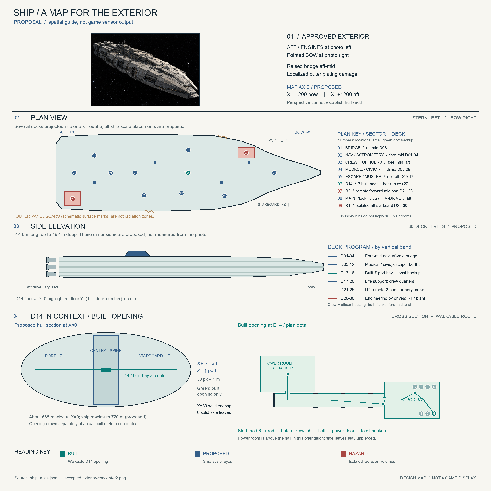
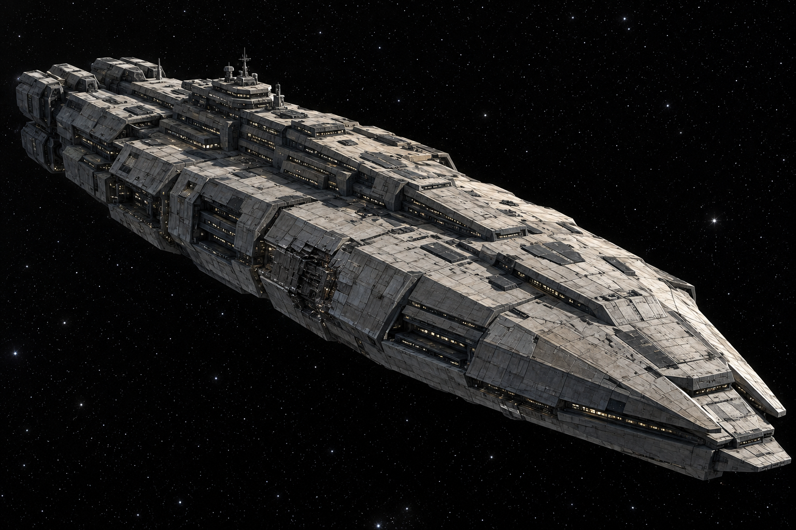

# GONE: whole-ship design note

Status: proposed interactive interior atlas; accepted exterior study v2. The
built game slice is a handful of rooms. The atlas proposes the ship around
that slice, without turning index bins into playable rooms or confirmed hull
geometry. Story facts, built geometry, and proposed placements are marked
separately.

## Start with these two screen-sized guides

1. [Where you are on the ship](ship-overview-simple.png): accepted exterior
   orientation, then a proposed five-stop ship-length route with the built
   seven-pod start in the middle.
2. [Your first rooms](ship-start-simple.png): the actual built, metric opening
   and the six actions from your pod to the local backup console. The solid
   leaves and end wall do not connect to the proposed ship yet.

Rebuild both PNGs from the atlas with
`python3 docs/art/ship/build-simple-guide.py`. The accepted exterior study
and the detailed board below remain unchanged.

## Explore the current proposed atlas



[Open at full resolution](ship-map-board.png). On the board, the bow points
right and the engines sit left; the central green D14 start marks the built
opening. Blue marks proposed facilities and red marks proposed radiation
regions. These are planning views; the accepted v2 photo is retained
unchanged. The board and accepted v2 photo were directly inspected. Plan X
and Z use the same meter scale. The 2.4 km x 720 m x 192 m envelope and 30
decks remain unapproved proposals, not measurements available from a 3/4
photo. Rebuild the board with `python3 docs/art/ship/build-map-board.py`.

From the repository root, open the [interactive 3D ship atlas](3d/atlas.tscn):

```sh
godot --path . docs/art/ship/3d/atlas.tscn
```

Validate the [atlas data](3d/ship_atlas.json) without opening the scene:

```sh
godot --headless --path . -s docs/art/ship/3d/validate_atlas.gd
```

This is an out-of-world planning view, not a walkable ship or an in-game
sensor display. The scene reads the atlas data and shows a proposed hull
planning envelope, individual floor datums, function-colored district index
bins, facilities, and the built opening footprint at true meter scale.
After the atlas change, the 1600x900 Godot Metal Forward+ overview, D14
opening, and D22 R2 detail captures (`tmp/ship-atlas-verify/overview.png`,
`tmp/ship-atlas-verify/opening.png`, `tmp/ship-atlas-verify/detail.png`)
were directly inspected. They show a pointed bow at right and broad aft
at left in the 3D guide, the meter-scale opening, and two tiny proposed
remote pods inside the R2 envelope. These three views do not establish
visual quality across all 30 decks or exact photogrammetry. An image
subagent was unavailable, so these captures were not independently
reviewed by one. The accepted [exterior study v2](exterior-concept-v2.png)
is unchanged. Andrew's v2
observations place the pointed bow to the image right/lower foreground,
the broad blocky aft engine mass to the left/upper background, and the
raised bridge on the broad aft-midsection. The atlas assigns bow to -X
and stern to +X. Its asymmetric, broad-aft hull cage is an
exterior-compatible proposal, not a measured tracing: v2 is a 3/4 image
and does not confirm quantitative width or depth. One localized damaged
outer side section leaves the keel and the rest of the hull intact.

Use the left panel's deck selector for overview or any of 30 floors
(D01–D30). Toggle port, core, or starboard; search facilities by id, kind,
deck, or status, then click one to focus it and read its coordinates and
source. Search districts by function, group, sector, side, or id, then click
a result to focus its proposed bin and view its deck range. District search
shows the first 35 matches, so refine the query to find others. The route
and power checkboxes toggle their overlays. Drag to orbit, Shift-drag to
pan, and use the wheel to zoom. R resets, [ and ] change decks, 0 returns
to overview, and D focuses the built D14 opening. The colors distinguish
function tags on bins; green marks built facilities, blue proposed
facilities, and red sealed radiation regions. Markers enlarge for overview;
facility bounds and the opening walls remain at meter scale.

The proposed design envelope is about **2400 m long x 720 m wide x 192 m
deep**, from X=-1200..1200, Z=-360..360, Y=-96..96. That is 2.4 km,
or 100 lengths of the built 24 m hall end to end; its 720 m beam is about
seven 100 m fields side by side. These dimensions are planning limits, not
approved exterior measurements or a claim that the hull fills the box.
The proposed piecewise-linear hull profile tapers sharply toward -X,
broadens to the +X aft engine section and keeps a substantial aft end.
The wire cage and floor datums use this profile; district rectangles are
index bins and may extend outside the guide. D30 cannot span the narrow
bow, so its floor datum starts where the hull has sufficient height.
Deck pitch is 5.5 m; D14's floor is Y=0 and D01–D30 use
`Y = (14 - deck number) * 5.5`. The built opening's 3.2 m ceiling remains
unchanged. The seven deck groups x five longitudinal sectors x three
lateral sides make **105 district index bins**, each standing for a
neighborhood of possible functions across a deck group. They are not 105
individually modeled rooms, room counts, or rectangular hull occupancy.
All 30 floors are individually selectable.

This is an out-of-world map. The fiction keeps exterior knowledge from the
player: the bible's chapter II gives the secondary terminal a basic deck
plan while the external sensor systems stay dead, so no reliable damage
data exists in-fiction (`docs/design/biblia.md`). Early sensor views cannot
display the exterior state or this whole atlas. In-fiction plans and routes
arrive piecemeal as repairs land.

## Sources

| Source | What it fixes |
| --- | --- |
| `docs/design/biblia.md` | Story facts: the adrift damaged colonial military ship, more than a hundred years abandoned, quarters and astrometry as story locations, the irradiated armory, escape craft, generation separated from distribution. |
| `docs/design/concept.md` | Setting and pillars: Battlestar Galactica tradition, industrial lived-in military ship, compartments as a graph of hatches and crawlways, the seven-pod opening. |
| `docs/art/README.md` | Visual language: worn riveted plated ship; stasis pods as pale rounded hardware that reads newer than the hull around it. |
| `sim/pods.gd`, `app/rod.gd`, `app/hallway.gd`, `app/power_room.gd` | The built playable slice: frozen coordinates, colliders, and interactables. |
| `docs/art/ship/3d/ship_atlas.json`, `docs/art/ship/3d/atlas.gd` | Proposed district, facility, route, hazard, and power placements; current interactive presentation. |

## Established

### Story and tone

- The ship is a huge damaged colonial military vessel, adrift and abandoned
  for more than a hundred years (`docs/design/biblia.md`, Parte I and
  Parte V). The bible fixes neither exterior dimensions nor crew count.
- Primary generation is separate from distribution; repairing buses,
  breakers, and controllers is its own problem
  (`docs/design/biblia.md`, sections 30 and 46).
- Locations the story needs somewhere aboard: crew quarters (chapter V),
  astrometry (the partner's message), an armory inside an irradiated
  section (sections 35 and 48), escape craft (the evacuation, section 7).
- Visual language: worn riveted plated military ship; pale newer pods
  installed in the old hull (`docs/design/concept.md`,
  `docs/art/README.md`).

### The built slice (walkable today)

All coordinates are floor-plan meters (x, z), up is +Y, matching the code.
The atlas places this built slice on D14 at Y=0; the assignment of a ship
number to the opening is a planning decision, not a new game level.

| Feature | Coordinates | Source |
| --- | --- | --- |
| Stasis bay envelope | X=-6..6, Z=-4..4, ceiling 3.2 m | `sim/pods.gd` ROOM_LENGTH, ROOM_WIDTH, ROOM_CEILING_HEIGHT |
| Player pod (id 6, the seventh pod) | (-4.8, +2.9) | `sim/pods.gd` _frozen_pods, ROW_B_Z |
| Six other pods | four at z=-2.9 (x=-4.8, -3.4, -2.0, -0.6); two at z=+2.9 (x=-3.4, -2.0) | `sim/pods.gd` _frozen_pods, ROW_A_Z, ROW_B_Z |
| Rod on the floor (the hatch's pry bar) | (-0.6, -1.55), a deliberate step off the aisle | `app/rod.gd` FLOOR_CENTER |
| Rod pickup reach | 1.3 m | `app/motion.gd` ROD_PICKUP_REACH |
| Jammed hatch | (6, 0), pry open with the rod within 2.2 m | `sim/pods.gd` _hatch_placement, `app/motion.gd` HATCH_INTERACT_REACH |
| Hall switch (hall face of the doorway wall) | (6.22, +0.85) | `app/hallway.gd` SWITCH_PLATE_CENTER |
| Corridor | X=6..30, Z=-1.5..1.5, ends in a solid endcap wall | `app/hallway.gd` HALL_START_X, HALL_END_X, hallway_solids |
| Decorative side doors (unpierced) | X=9, 15, 21, both sides | `app/hallway.gd` SIDE_DOOR_STATIONS_X |
| Power door (pierced north wall) | (27, -1.5) | `app/hallway.gd` POWER_DOOR_X |
| Power room envelope | X=21..33, Z=-1.7..-9.7 | `app/power_room.gd` room_solids |
| Secondary generator column | (27, -5.7) | `app/power_room.gd` GENERATOR_CENTER |
| Working console | station (21, -7.5), act point (22.05, -7.5) | `app/power_room.gd` console_stations, console_act_center |

## Proposed geography, access, and hazards

The 3D atlas uses -X for fore/bow, +X for aft/stern, -Z for port,
+Z for starboard, and +Y for up. Those ship directions are proposed
alignments with the built level coordinates. Its seven deck groups index
command and navigation, awake crew quarters, civic and medical care,
escape muster, stasis and local distribution, life support and repair,
engineering, primary generation, and propulsion. Crew berths and officer
staterooms are distributed fore, midship, and aft on both port and
starboard, near command/navigation, medical, and engineering work areas.
Neither the number of bins tagged for cabins nor their area fixes crew or
berth capacity. Crew normally live and work awake.

| Deck group | Proposed program and anchors |
| --- | --- |
| D01–04 | Proposed upper bridge anchor at (+480, 60.5, 0), D03, in aft-mid sector 3 core; separate operations/watch and command support in sector 2 core, plus navigation, astrometry, flight plotting, signals, officer staterooms, and nearby crew cabins. |
| D05–08 | Medical, hospital and clinic space, berth neighborhoods, officer staterooms, family commons, school and civic rooms. An outboard berth bay and adjacent sealed compartment are exploratory candidates for the one localized damage section. |
| D09–12 | Escape craft and muster, mess, gardens, commons, and distributed berths. An outer launch bay and adjacent sealed compartment remain exploratory alternatives for that same localized damage section, not another scar. |
| D13–16 | D14 built seven-pod opening, hall and local backup power, plus proposed medical annex, service, transit, distribution and awake crew quarters. No additional stasis banks. |
| D17–20 | Air and water plant, life support, workshops, electrical grid, freight, repair, and crew quarters. |
| D21–25 | Sheltered forward-mid R2 in sector 1 port, with a separately shielded irradiated armory and a proposed isolated two-pod room at D22. Sector 0 port is proposed hull inspection and repair staging, without another radiation region; other fabrication, containment and service functions remain proposed. |
| D26–30 | Aft engineering and maintenance, one D27 primary generation plant near the D28 M-drive, and aft R1 radiation isolation. Crew and officer quarters also appear near engineering. |

There are **nine pods total in this plan**: seven in the built D14 bay and
only two proposed in the distant D22 room. The remote room's purpose and
two-pod allocation await Andrew's decision. Stasis supports medical or
mission-continuity use, not mass crew accommodation. R1 is proposed near
the aft M-drive at (1045, -77, +235), X=970..1120, Z=170..300,
spanning D26–30. R2 is separately proposed in sheltered forward-mid
sector 1 port at (-525, -44, -180), X=-600..-450, Z=-230..-130,
spanning D21–23. The armory at (-560, -44, -190), X=-577..-543,
Z=-208..-172, and the two-pod room at (-490, -44, -170),
X=-507..-473, Z=-184..-156, are disjoint sealed rooms inside R2. The
proposed remote pods sit at (-490.7, -44, -170) and
(-489.3, -44, -170). The armory's irradiation is a story fact; these
placements and both regions' radiation causes are unconfirmed.
Neither is inferred from hull scars. Do not infer an expanded M-drive or
invent its operating physics from the R1 label.

### Route and power graph (planning legend)

| Edge or marker | Meaning |
| --- | --- |
| `bay -> hatch -> hall -> power_door -> power_room` | Built D14 route. Hatch needs the rod; the hall and power doorway are pierced. |
| `hall -> leaf_15_south` | Built line ending at a decorative solid leaf at (15, 0, +1.5). It is impassable. Leaves at X=9, 15, 21 on both sides, the X=30 endcap and the bay's X=-6 wall remain solid. |
| `leaf_15_south -> future_neighbor -> future passages` | Future route only. Piercing the wall and building the extension must happen before any connection; the other leaves and endcap also require physical wall modification for future routes. |
| Port/starboard spines, cross-links, four through-deck trunks | Proposed routes, not built walkable space. Sealed dead-end spurs isolate the two radiation zones. |
| `plant -> isolation -> distribution -> breakers` | One proposed **primary generation** plant at D27 (+700, -71.5, 0), near the engine; generation and ship-wide distribution are distinct stages. |
| `secondary -> local_emergency -> transfer` | Built D14 secondary generator at (27, 0, -5.7) powers the local emergency bus. It is backup, not a second main plant. Transfer to ship-wide breakers is sealed; no bay or hall feed is mapped by the atlas. |

## Earlier drawings and exterior studies

[Ship deck atlas v2 (earlier exploratory proposal)](ship-deck-atlas-v2.svg)
and [transverse section v1 (earlier exploratory proposal)](ship-transverse-section-v1.svg)
remain available for their diagram and opening-inset history. **Both are
superseded** by the interactive 3D atlas on proposed ship size, stasis
bank count, two separate radiation hazards, and primary versus backup
power topology. Do not treat their labels or dimensions as current
planning decisions.

In the earlier longitudinal atlas, left/right followed ship X (bow to
stern), deck groups ran along Y, and lateral Z was implicit. Its 35
functional districts and four vertical trunks were proposals. The older
section looked along X from near the opening: -Z was on the left, Y was
vertical, and X pointed into the page. Its top-down local opening inset
put +X right, +Z up, and +Y out of the page. These axes and the built
opening route remain useful when comparing drawings. Its repeated cells
stood for parallel lateral neighborhoods, not room counts; five shafts
and cross-aisles were proposed in the section, not built. The scar's X
position was undecided in that cut; the keel and pressure shell were
intended intact.
The previous drawing placed the opening schematically within D13–16 and
used D14 only as a display row. The current 3D plan assigns the opening
to D14 with Y=0 while retaining the built geometry unchanged. The old
~450 m beam and ~140 m depth, along with an earlier 900 m ship length
and 60 m depth, were unapproved studies. In particular, 60 m cannot
accommodate 30 decks at this scale; the 3D plan's 5.5 m pitch and
~192 m depth are still proposals, not measurements of the exterior.



[Open exterior study v2](exterior-concept-v2.png). The accepted exterior
concept remains unchanged. The profile follows the orientation and
silhouette observations supplied by Andrew; it is not a measured tracing
of the image or the Godot scene. The v2 photo and final board were directly
inspected, along with the three Godot captures described above; those
captures cover selected views, not every deck.

[Open exterior study v1 (earlier study)](exterior-concept-v1.png). The earlier
image remains available as a first study; it is not the current exterior
direction. The old [ship map v1](ship-map-v1.svg) is a superseded
exploratory draft, rejected as too small and corridor-like; do not use it
as the ship layout.

For any subsequent exterior work, keep the less cylindrical plated
silhouette with an intact keel, drive machinery, and main pressure shell
so the vessel can move again. Keep v2's visible outer-plate damage
localized to one outboard side section with adjacent sealed compartments;
distribution and air handling inside still need repair. Vacuum exposure ages outer plates
through sunlight, impacts, and thermal fading, without oxygen rust.
Inside the pressurized ship, atmospheric corrosion, leaks, and damaged
fittings remain plausible. Use hard directional sunlight and deep shadow
against black space, without atmospheric haze or fog. These are design
requirements for future inspection, not claims about what v2 depicts.
Follow the visual language in `docs/art/README.md`.

## The opening route (established, walkable today)

1. Wake in pod id 6 at (-4.8, +2.9) (`sim/pods.gd`).
2. Cross the aisle and step off it to the rod at (-0.6, -1.55); the
   pickup is deliberate, outside every walking line's 1.3 m reach
   (`app/rod.gd`, `app/motion.gd`).
3. Carry the rod to the jammed hatch at (6, 0) and pry it open from
   within 2.2 m (`app/motion.gd`).
4. Enter the corridor and press the hall switch at (6.22, +0.85) beside
   the doorway; the corridor's steady red lights (`app/hallway.gd`).
5. Walk to the door at (27, -1.5) on the corridor's -Z side and
   act it open (`app/hallway.gd`, `app/power_room.gd`).
6. Inside the power room, act the working console at (22.05, -7.5):
   Inactivo to Activo lights the secondary generator and hands the
   corridor and room to regular white (`app/power_room.gd`).

Further routes are proposals only. The six decorative doors at X=9, 15,
21 could become connections to future compartments only after walls are
pierced. The corridor endcap and stasis bay's -X wall are solid today;
connections there would also require piercing the walls. Nothing beyond
the power-room console exists in the build.

## Decisions for Andrew

1. Scale: accept or adjust the proposed ~2400 x 720 x 192 m envelope,
   D01–D30 deck pitch, and hull taper without treating index bins as
   occupied space or the accepted exterior image as an orthographic plan.
2. Crew population: choose the awake complement and the daily-life and
   escape capacity it implies. The bible specifies no crew count.
3. Berths: set actual crew-berth and officer-stateroom counts and sizes
   near command, navigation, medical and engineering; the colored bins
   alone do not determine them.
4. Remote D22 room: choose its purpose and whether the proposed two pods
   belong there; retain the seven built opening pods. Do not add mass
   stasis banks by default.
5. Radiation: decide separate causes, limits, and isolation requirements
   for aft R1 and fore R2, including the irradiated armory and remote
   room. Neither cause is currently specified.
6. Propulsion: decide what the M-drive does and how it operates. Its
   placement does not establish an expanded engine or radiation source.
7. Routes and damage: decide which outboard bays and adjacent rooms are
   sealed, which proposed spines and trunks connect, and where to modify
   built walls for any future opening connection. Keep today's endcap,
   six unpierced leaves, bay wall, and local power coordinates explicit.
